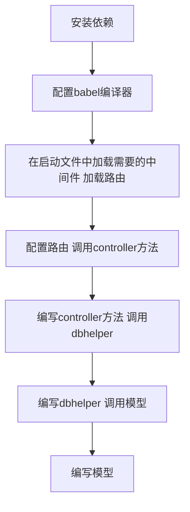

# NodeJS后端服务搭建
## 安装依赖
```javascript
"dependencies": {
    "babel-preset-env": "^1.4.0",
    "babel-register": "^6.24.1",
    "bluebird": "^3.5.0",
    "koa": "^2.2.0",
    "koa-bodyparser": "^4.2.0",
    "koa-cors": "^0.0.16",
    "koa-logger": "^2.0.1",
    "koa-router": "^7.1.1",
    "koa-session": "^5.0.0",
    "lodash": "^4.17.4",
    "moment": "^2.22.2",
    "mongoose": "^4.9.5",
    "sha1": "^1.1.1",
    "uuid": "^3.0.1",
    "xss": "^0.3.3"
  }
```
解释一下这些依赖都是用来干嘛的.
```javascript
"koa": "^2.2.0",
"koa-bodyparser": "^4.2.0",
"koa-cors": "^0.0.16",
"koa-logger": "^2.0.1",
"koa-router": "^7.1.1",
"koa-session": "^5.0.0",
```
koa是一种简单好用的 Node Web 框架，koa2实现了一些ES7的新特性，比如 async/await，使编写异步调用更加方便。koa核心代码非常小巧，大部分功能都是通过插件形式实现的。这里我们安装了`koa-cors`实现服务器跨域访问，`koa-logger`实现日志记录，`koa-router`实现路由功能，`koa-session`实现cookie-based session功能，`koa-bodyparser`实现bodyparser功能。
```javascript
"babel-preset-env": "^1.4.0",
"babel-register": "^6.24.1"
```
用来编译es6、7的语法。
```javascript
"bluebird": "^3.5.0"
```
Promise 库，提供了一些原生Promise没有的功能。
```javascript
"sha1": "^1.1.1"
```
sha1加密工具。
```javascript
"mongoose": "^4.9.5"
```
操作mongodb的工具。
```javascript
"xss": "^0.3.3"
```
过滤用户输入避免xss攻击的工具。

## 目录结构
```javascript
├── README.md
├── app
│   ├── controllers // 处理具体逻辑代码目录
│   │   ├── app.js  // 封装一些公用的方法
│   │   ├── article.js  // 文章相关的逻辑
│   │   └── user.js // 用户相关的逻辑
│   ├── dbhelper    // 封装了操作数据库的方法
│   │   ├── userHelper.js
│   │   └── articleHelper.js    
│   ├── models  // 定义了数据模型，也就是集合结构
│   │   ├── article.js
│   │   └── user.js
│   └── service
│       └── service.js  // 自定义一些第三方的服务
├── app.js  // 启动文件
├── config
│   └── router.js   // 开放的路由接口
└── package.json
```
## babel配置
.babelrc
```javascript
{
  "presets": [
    ["env", {
      "targets": {
        "node": true
      }
    }]
  ]
}
```
## 启动文件
app.js
```javascript

'use strict'

const fs = require('fs')
const path = require('path')
const mongoose = require('mongoose')

const db = 'mongodb://localhost/test'

/**
 * mongoose连接数据库
 * @type {[type]}
 */
mongoose.Promise = require('bluebird')
mongoose.connect(db)

/**
 * 获取数据库表对应的js对象所在的路径
 * @type {[type]}
 */
require('babel-register')
const Koa = require('koa')
const logger = require('koa-logger')
const session = require('koa-session')
const bodyParser = require('koa-bodyparser')
const cors = require('koa-cors');
const app = new Koa()

app.keys = ['zhangmichael']
app.use(cors({
  origin: function (ctx) {
    if (ctx.url === '/test') {
      return "*"; // 允许来自所有域名请求
    }
    return "*";
  },
  exposeHeaders: ['WWW-Authenticate', 'Server-Authorization'],
  maxAge: 5,
  credentials: true,
  allowMethods: ['GET', 'POST', 'DELETE'],
  allowHeaders: ['Content-Type', 'Authorization', 'Accept'],
}))
app.use(logger())
app.use(session(app))
app.use(bodyParser())

/**
 * 使用路由转发请求
 * @type {[type]}
 */
const router = require('./config/router')()
app
  .use(router.routes())
  .use(router.allowedMethods());

app.listen(8001)
console.log('app started at port 8001...');
```

启动文件主要做了以下几件事情。

1. 加载中间件
2. 连接mongoDB
3. 启用服务

这里加载了config/router下导出的router。
#### Router中间件
config/router.js

```javascript
'use strict'

const Router = require('koa-router')
const App = require('../app/controllers/app')
const Article = require('../app/controllers/article')

module.exports = function(){
    // 添加路由前缀
    var router = new Router({
        prefix: '/api'
  })

  // article
  router.post('/article/add', App.hasBody, Article.addArticle)  // 只有App.hasBody执行通过后才会执行下一步
  router.get('/article/list', Article.listArticle)
  router.get('/article/get', Article.getArticle)
  router.post('/article/update', App.hasBody, Article.updateArticle)
  router.post('/article/delete', App.hasBody, Article.deleteArticle)
  router.post('/article/hide', App.hasBody, Article.hideArticle)
  return router
}

```
这里引入了controllers/下定义一些controller方法。
#### controllers
controllers/app.js
```javascript
'use strict'

// 用于封装controllers的公共方法

var mongoose = require('mongoose')
var uuid = require('uuid')
var User = mongoose.model('User')

exports.hasBody = async (ctx, next) => {
  var body = ctx.request.body || {}
  console.log('body', body)
  console.log(body)

  if (Object.keys(body).length === 0) {
    ctx.body = {
      success: false,
      err: '某参数缺失'
    }

    return next
  }

  await next()
}

// 检验token
exports.hasToken = async (ctx, next) => {
  var accessToken = ctx.query.accessToken

  if (!accessToken) {
    accessToken = ctx.request.body.accessToken
  }

  if (!accessToken) {
    ctx.body = {
      success: false,
      err: '令牌失效'
    }

    return next
  }

  var user = await User.findOne({
    accessToken: accessToken
  })
  .exec()

  if (!user) {
    ctx.body = {
      success: false,
      err: '用户没登陆'
    }

    return next
  }

  ctx.session = ctx.session || {}
  ctx.session.user = user

  await next()
}
```
app controller里面可以封装一些公用的方法在router当中调用。
controllers/user.js
```javascript
'use strict'

var xss = require('xss')
var mongoose =  require('mongoose')
import User from '../models/user';
var uuid = require('uuid')
// var userHelper = require('../dbhelper/userHelper')
import userHelper from '../dbhelper/userHelper'

/**
 * 注册新用户
 * @param {Function} next          [description]
 * @yield {[type]}   [description]
 */
exports.signup = async (ctx, next) => {
	var phoneNumber = xss(ctx.request.body.phoneNumber.trim())
	var user = await User.findOne({
	  phoneNumber: phoneNumber
	}).exec()
  console.log(user)
	
	var verifyCode = Math.floor(Math.random()*10000+1)
  console.log(phoneNumber)
	if (!user) {
	  var accessToken = uuid.v4()

	  user = new User({
	    nickname: '测试用户',
	    avatar: 'http://upload-images.jianshu.io/upload_images/5307186-eda1b28e54a4d48e.png?imageMogr2/auto-orient/strip%7CimageView2/2/w/1240',
	    phoneNumber: xss(phoneNumber),
	    verifyCode: verifyCode,
	    accessToken: accessToken
	  })
	}
	else {
	  user.verifyCode = verifyCode
	}

	try {
    user = await user.save()
    ctx.body = {
      success: true
    }
  }
  catch (e) {
    ctx.body = {
      success: false
    }

    return next
  }

}

```
user controller调用了dbhelper下面用来操作数据库的方法。
## dbhelper
```javascript
'use strict'

var mongoose =  require('mongoose')
var User = mongoose.model('User')

/**
 * 通过电话号码查询
 * @param  {[type]} options.phoneNumber [description]
 * @return {[type]}                     [description]
 */
exports.findByPhoneNumber = async ({phoneNumber}) => {
	var query = User.find({phoneNumber})
	var res = null
	await query.exec(function(err, user) {
		if(err) {
			res = {}
		}else {
			res = user
		}
	})
	// console.log('res====>' + res)
	return res;
}

/**
 * 查找所用用户
 * @return {[type]} [description]
 */
exports.findAllUsers = async () => {
	var query = User.find({});
	var res = []
	await query.exec(function(err, users) {
		if(err) {
			res = []
		}else {
			res = users;
		}
	})
	return res
}

/**
 * 增加用户
 * @param  {[User]} user [mongoose.model('User')]
 * @return {[type]}      [description]
 */
exports.addUser = async (user) => {
	user = await user.save()
	return user
}

/**
 * 删除用户
 * @param  {[type]} options.phoneNumber [description]
 * @return {[type]}                     [description]
 */
exports.deleteUser = async ({phoneNumber}) => {
	var flag = false
	console.log('flag==========>'+flag)
	await User.remove({phoneNumber}, function(err) {
		if(err) {
			flag = false
			// return false
		}else{
			flag = true
		}
		
	})
	console.log('flag=====await=====>'+flag)
	return flag
}

```
这里会引入下面定义的 MongoDB 模型。
## MongoDB集合定义
models/article.js
```javascript
'use strict'

var mongoose = require('mongoose')
var Schema = mongoose.Schema

/**
 * 定义一个模式(相当于传统意义的表结构)
 * 每个模式映射mongoDB的一个集合，
 * 它定义（只是定义，不是实现）这个集合里面文档的结构，就是定义这个文档有什么字段，字段类型是什么，字段默认值是什么等。
 * 除了定义结构外，还定义文档的实例方法，静态模型方法，复合索引，中间件等
 * @type {mongoose}
 */
var ArticleSchema = new Schema({
  title: String,
  subTitle: String,
  author: {
    type: String,
    default: '张黔'
  },
  category: String,
  summary: String,
  content: String,
  viewedCount: Number,
  meta: {
    createAt: {
      type: Date,
      dafault: new Date()
    },
    updateAt: {
      type: Date,
      dafault: new Date()
    },
    isHide: {
      type: Boolean,
      default: false
    }
  }
})

// Defines a pre hook for the document.
ArticleSchema.pre('save', function (next) {
  if (this.isNew) {
    this.meta.createAt = this.meta.updateAt = Date.now()
  } else {
    this.meta.updateAt = Date.now()
  }
  next()
})


/**
 * 定义模型Article
 * 模型用来实现我们定义的模式，调用mongoose.model来编译Schema得到Model
 * @type {[type]}
 */
// 参数Article 数据库中的集合名称, 不存在会创建.
var Article = mongoose.model('Article', ArticleSchema)

module.exports = Article
```
## 总结
整个搭建的流程如下图所示

