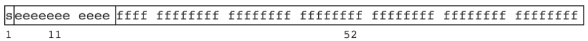
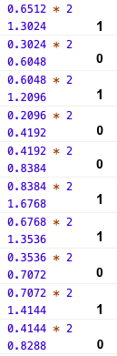

# JS数字存储与读取问题
先不看JS中数字是如何存取的，我们研究下数字的存储需要考虑到哪些问题。
1. 符号如何存储，即如何表示正数和负数？
2. 整数如何存储？
3. 小数中小数点如何存储，小数部分又符合存储？
4. 数字存储的范围是多少，如果超出范围会怎样？

带着这些问题，再看JS中是如何解决的。

## 存储
JS 遵循 IEEE 754 规范，采用双精度存储（double precision），占用 64 bit。

- 1位表示符号位，`0`表示整数，`1`表示负数
- 11位表示指数位，第一位为符号位，`1`位正，`0`位负，可表示的范围`(2^-10 - 1) ~ (2^10)`
- 52位表示尾数位，可表示的范围`-(2^53 - 1) ~ (2^53 - 1)`

JS中数字的存储分为几个步骤，以存储`3.6512`为例：
1. 先存储符号位，0
2. 将整数部分转换为二进制，11
3. 将小数部分转换为二进制，计算过程如下图，将小数部分乘以2，如果结果小于1则记为0，如果结果大于1，则记为1并删除整数部分重复以上操作直到结果等于1为止。将每次计算得到的二进制数从上至下排列，最终结果是1010011010。注意，这并非是精确值，因为计算还没有结束，只有计算结果刚好出现整数1的时候得到的二进制数才是精确值，即小数部分完全由二进制表示。先不讨论是否精确，现在整数部分和小数部分都转换成二进制了，即11.1010011010。



4. 小数点要如何表示呢？`11.1010011010`用科学计数法表示`1.11010011010 * 2^1`，保存对应的指数就可以了，这里为`1`，实际保存时需要加上`2^10 - 1`的偏移值，也就是`1 + 1023`（因为指数有正负，为了方便计算）。整数部分的`1`可以不用存储，因为科学计数法表示的整数部分肯定为`1`，这就是为什么52位尾数可存储的范围是`-(2^53 - 1) ~ (2^53 - 1)`了.

所以我们最终要存储的为
1. 符号位，这里为`0`
2. 指数部分，偏移值为`01111111111`（2^10 - 1 = 1023），加上`1`后为`10000000000`（1023 + 1 = 1024）；
3. 尾数部分，出掉整数部分的`1`，剩下小数为`11010011010`

转换成存储结构为
`0 10000000000 1101 00110100 00000000 00000000 00000000 00000000 00000000`

## 读取
1. 符号位`0`表示正
2. 指数位`2^10`减去偏移值`2^10 - 1`得到`1`，那么整数部分的结果是`1 * 2^1 = 2`
3. 尾数部分计算，幂次从0开始递减，`1*2^0 + 1*2^-1 + 1*2^-3 + 1*2^-6 + 1*2^-7 + 1*2^-9 = 1.6533203125`
4. 最终结果为`2 + 1.650390625 = 3.650390625`

最终结果和原始结果相比存在一定误差，是因为十进制的小数部分转换成的二进制数时我们只计算到了10位且没有出现整数1，如果需要更准确的值，可以计算到到出现整数1或尾数部分允许的52位。但存在一些情况，就是计算到52位仍然没有出现整数1，那么意味着这个数无法精确存储，即发生精度丢失。

## 精度丢失

### 整数精度丢失
如果整数大于`2^53 - 1`或小于`-(2^53 - 1)`会出现精度丢失。
### 小数精度丢失
如果小数不能精确的由二进制表示，则会发生精度丢失。
最经典的例子就是
```js
(0.1 + 0.2) == 0.3 // false
```
JS中的数值计算需要先将数值转换为二进制再进行计算。`0.1`和`0.2`转换为二进制分别为`0.0001 1001 1001 1001...(1100循环)`和`0.0011 0011 0011 0011...(0011循环)`，由于两者都没有转换成精确的二进制表示，结果就可能出现一些误差。

## 特殊值
由上述双精度存储规则可知，总共有2^64个可存储的值。其中JS在指数位全为1的情况下（2^53，即1符号位，52尾数位）划定了以下三个特殊值：
1. 正无穷：符号位为1，11指数位全为1,52位是0
2. 负无穷：符号位为0，11指数位全为1,52位是0
3. NaN：11指数位全为1,52位不全为0的某一个值，算上1位符号位，可取范围为2^53 - 2(正负无穷)，即这个范围内的值都看做NaN

这些特殊值都属于Number类型，那么Number类型的可取范围就是2^64 - 2^53 + 3;

## Number.EPSILON
JS提供了一个最小精度`Number.EPSILON`，其值为`2^-52`，即符号位为1，指数位-52，尾数位全为0。如果两个数值的差值小于等于这个最小精度，可以认为它们是相等的。

## Number.MAX_VALUE
Number.MAX_VALUE表示JS中最大的数，其近似值为1.7976931348623157 x 10^308。对应双精度存储规则是符号位为1，指数位为11111111110（运算指数位2^11 - 2 - (2^10 - 1) = 2^10 - 1）,尾数位全为1，计算公式为：
```js
// 第一个为整数位，其余52位为小数位
// 2^(2^10 - 1) + 2^(2^10 - 2) + 2^(2^10 - 3) ... 2^(2^10 - 53)
function sum(s, i) {
  if (i < (Math.pow(2, 10) - 53)) {
    console.log(s);
  } else {
    s += Math.pow(2, i);
    i--;
    sum(s, i);
  }
}
sum(0, Math.pow(2, 10) - 1);
```

## 参考
[ECMAScript 2015 (6th Edition, ECMA-262)](https://www.ecma-international.org/ecma-262/6.0)
[MDN Number类型](https://developer.mozilla.org/zh-CN/docs/Web/JavaScript/Reference/Global_Objects/Number)