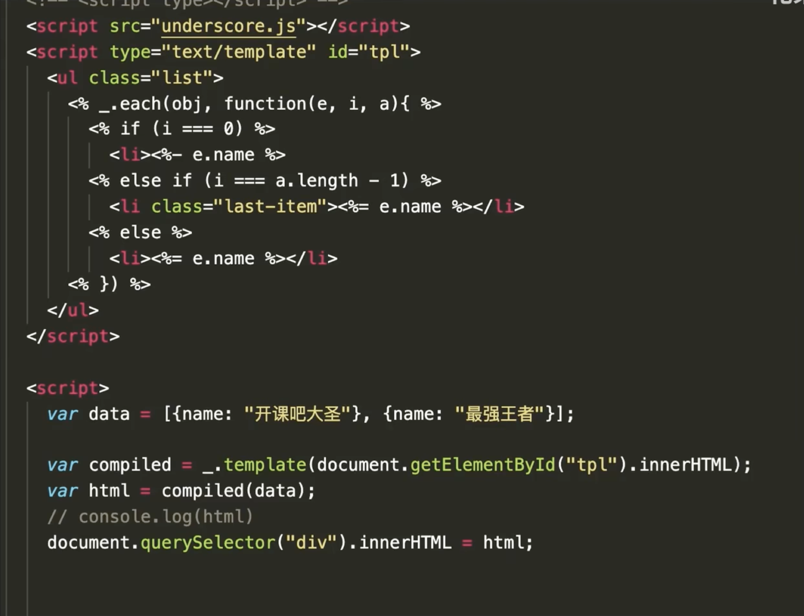
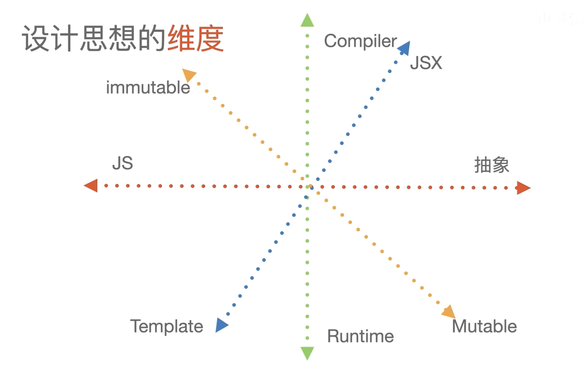
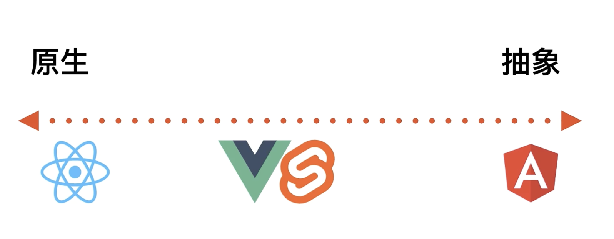
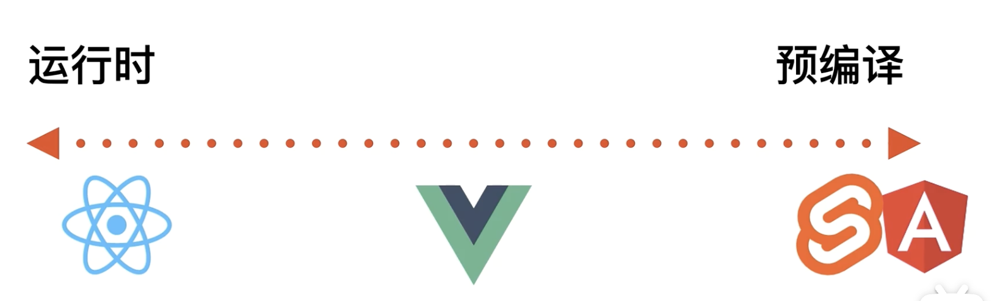
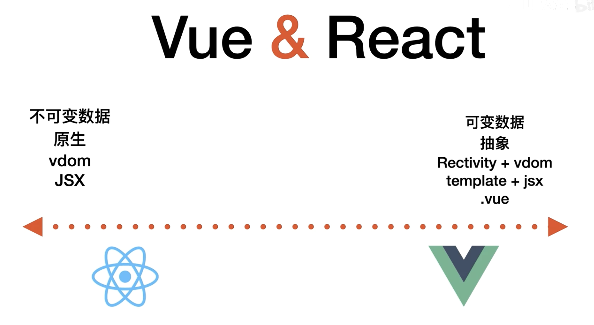
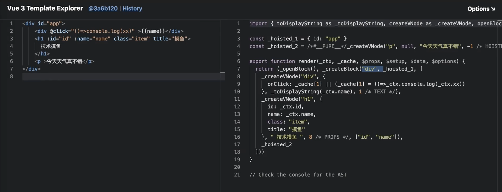
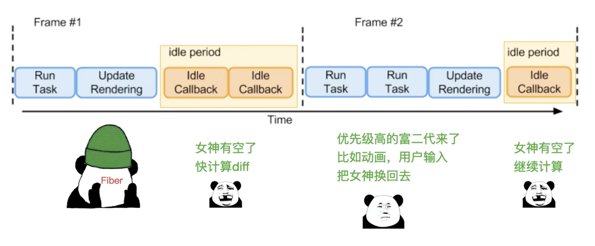
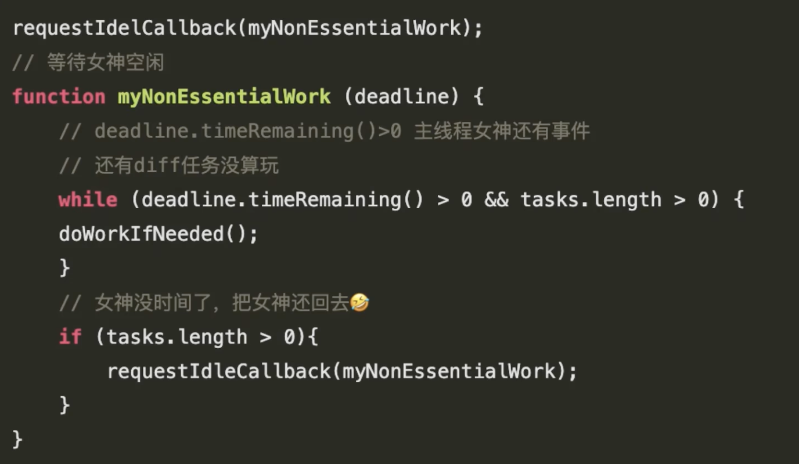

# React 与 Vue 框架的设计思路学习笔记
以下内容基于[React 与 Vue 框架的设计思路大 PK](https://www.bilibili.com/video/BV1az4y127Ga/?spm_id_from=333.337.search-card.all.click&vd_source=a595fd9605c68dd9ce4f51a8eba11f6a)进行整理，帮助理解 React 与 Vue 框架的设计思路。

## 框架发展
最早是基于字符串模板将数据填充到DOM，利用innerHTML更新DOM，比如 underscore、handlebars 等。

后来出现了数据驱动的 MVVM 框架，利用数据劫持和发布订阅模式，将数据和视图进行绑定，当数据发生变化时，视图会自动更新。代表库有 Vue、Angular、React 等。

## 框架设计思想维度

从图中可以看出框架设计主要有 4 个维度：
- 原生-抽象

- 不可变数据(immutable)-可变数据(mutable)
- 编译时-运行时

 - 静态template-动态JSX

## React vs Vue
Vue 和 React 在以上几个维度的对比：

1. 不可变数据 vs 可变数据

React 采用不可变数据，每次更新数据都是返回一个新的对象，而 Vue 采用可变数据，直接修改原对象。

2. 原生 vs 抽象

React 相对而言抽象的比较少，API 比较少，需要自己实现一些功能，比如路由、状态管理等。

Vue 相对而言抽象的比较多，API 比较多，不需要自己实现一些功能，比如路由、状态管理等。

3. vdom vs Reactivity+vdom

React 采用 vdom，即虚拟 DOM，每次更新数据都会生成一个新的 vdom，然后再将新的 vdom 与旧的 vdom 进行比较，然后将差异部分更新到 DOM 中。

Vue 采用 reactivity+vdom，即响应式数据+虚拟 DOM。

4. 静态template+动态jsx vs 动态JSX

React 采用动态JSX，由于是动态JSX，在静态编译的时候仅仅是将JSX编译为JS，不会做更多的优化。

Vue 采用静态template+动态JSX，由于是静态template，在静态编译的时候会做更多的优化，比如静态提升、缓存等，同时仍然支持动态JSX。如下图中，click函数被缓存了，h1标签记录了diff时仅需要对比props的依赖，p标签被静态提升了，不需要参与diff。

## React 的时间切片

## 继承和组合
React 和 Vue 的设计都倾向于组合，React 的 hooks，Vue 的 Composition API。

## 跨平台
React 和 Vue 都利用虚拟DOM实现跨平台。底层原理是虚拟DOM可以通过对象来描述原生DOM。