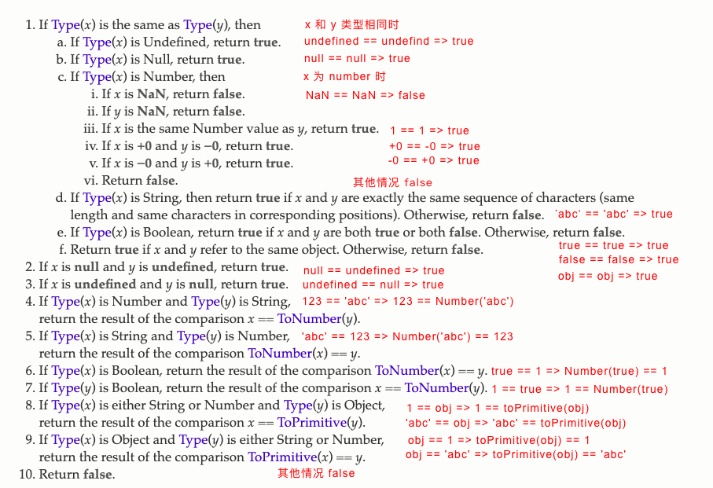

# JavaScript 比较
## == 运算符
### The Abstract Equality Comparison Algorithm 抽象相等比较算法
== 的结果遵循以下算法：

总结来说：
- 若类型相同，除了 NaN != NaN 之外，其他只要数值相等或字符串完全匹配或布尔值相同或引用相同，就相同
- 若类型不同
  - undefined 和 null 相等
  - 字符串和 bool 都转为数字再比较
  - 对象转换成 primitive 乐行再比较
  
## <、>、<=、>= 关系运算符
### The Abstract Relational Comparison Algorithm 抽象关系比较算法
