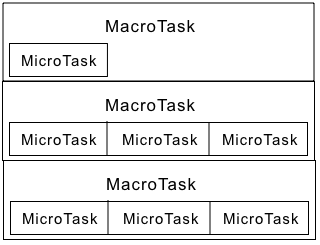
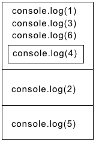

# 事件循环（EventLoop）
- 堆：一大块非结构化的内存区域，用于存储对象。
- 栈：函数调用形成了一个栈帧。一个栈帧包含了函数的参数和局部变量。
- 队列：一个 JavaScript 运行时包含了一个待处理的消息队列。每一个消息都关联着一个用以处理这个消息的函数。
- 事件循环：之所以称之为事件循环，是因为它经常按照类似如下的方式来被实现：

```js
while (queue.waitForMessage()) {
  queue.processNextMessage();
}
```
- 执行至完成：每一个消息完整地执行后，其它消息才会被执行。缺点是，如果一个消息执行时间太长，会阻塞浏览器的交互行为，解决方案就是缩短消息执行时间，或将消息裁切成多个消息。
- 添加消息：使用setTimeout添加。第二个参数表示延迟，最小值为0，即立即添加到队列末尾。
- 多个运行时互相通信：一个 web worker 或者一个跨域的 iframe 都有自己的栈，堆和消息队列。两个不同的运行时只能通过 postMessage 方法进行通信。如果另一个运行时侦听 message 事件，则此方法会向该运行时添加消息。

macrotask（按优先级顺序排列）: script(你的全部JS代码，“同步代码”）, setTimeout, setInterval, setImmediate, I/O,UI rendering
microtask（按优先级顺序排列）:process.nextTick,Promises（这里指浏览器原生实现的 Promise）, Object.observe, MutationObserver
js引擎首先从macrotask queue中取出第一个任务，执行完毕后，将microtask queue中的所有任务取出，按顺序全部执行；
然后再从macrotask queue（宏任务队列）中取下一个，执行完毕后，再次将microtask queue（微任务队列）中的全部取出；
循环往复，直到两个queue中的任务都取完。

## 宏任务(Macrotask)和微任务(Microtask)
### 定义
- 宏任务指的是宿主发起的任务
- 微任务指的是JS引擎发起的任务
### 关系
- 宏任务中可能包含微任务
- 先执行当前的宏任务，然后执行所有该宏任务下的微任务。微任务执行完，再等待执行下一个宏任务。

```js
let a = new Promise((resolve, reject) => {
  console.log(1);
  setTimeout(() => console.log(2));
  resolve();
})
console.log(3);
a.then(() => {
  console.log(4);
  setTimeout(() => console.log(5));
});
console.log(6)
```
分析对应的宏任务和微任务：



所以最后的打印顺序为：1，3，6，4，2，5
