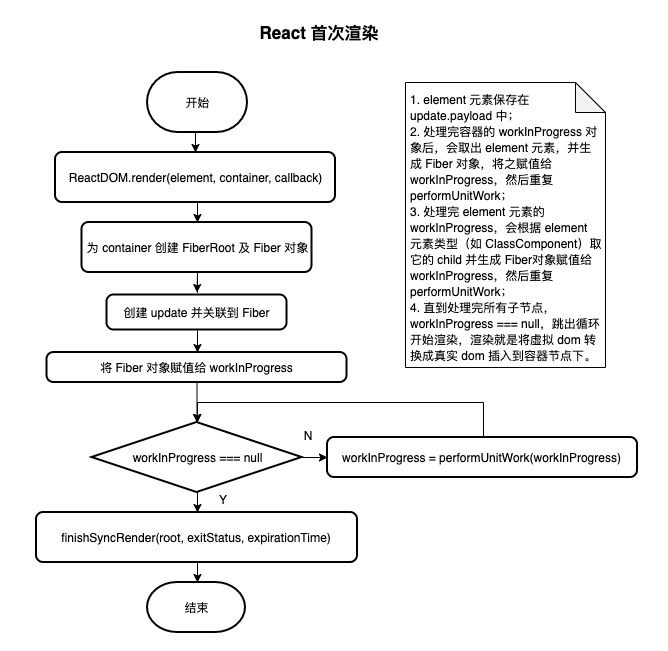
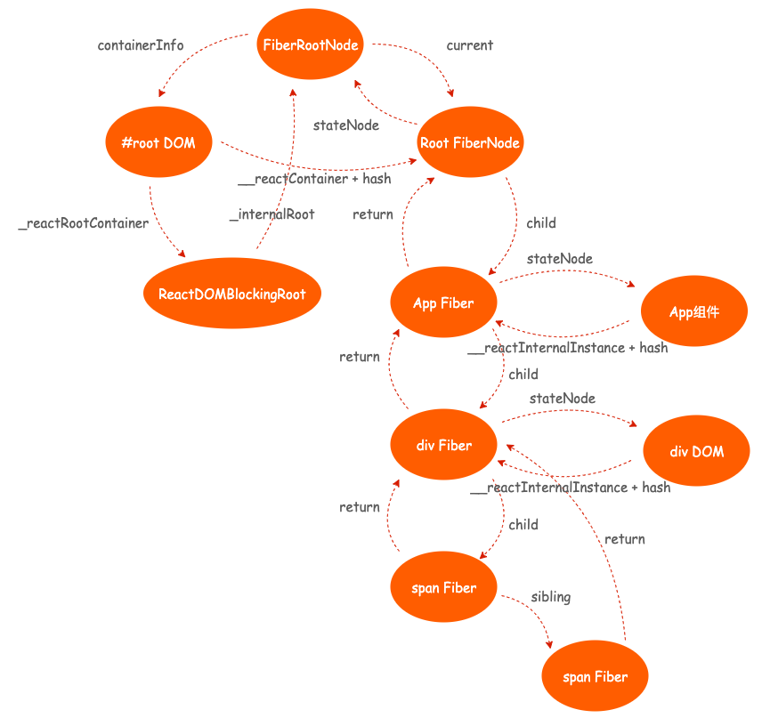

# React 16.12.0 源码解读（一）之首次渲染


```js
const APP = () => (
		<div>
				<span></span>
				<span></span>
		</div>
)
ReactDom.render(<APP/>, document.querySelector('#root'))
```
渲染以上组件得到的 `fiber tree`:


客户端首次渲染指的是调用 `ReactDOM.render` 方法将 `React` 元素挂载到 `dom` 元素上，结合源码，下面依次列举了执行 `render` 时的函数调用栈。
## `render`
调用 `ReactDOM.render` 方法，该方法接收三个参数。
- `element`， React 元素，通过 createElment() 方法创建
- `container`，容器 dom 元素
- `callback`

返回 `legacyRenderSubtreeIntoContainer` 方法执行结果。

由 `DOMContainer` 的定义可以看到，`container` 可以是元素和文档，它可以有一个类型为 `RootType` 的 `_reactRootContainer` 属性。
```js
type DOMContainer =
  | (Element & {
      _reactRootContainer: ?RootType,
    })
  | (Document & {
      _reactRootContainer: ?RootType,
    });

export function render(
  element: React$Element<any>,
  container: DOMContainer,
  callback: ?Function,
) {
  // 省略代码
  return legacyRenderSubtreeIntoContainer(
    null,
    element,
    container,
    false,
    callback,
  );
}
```
## `legacyRenderSubtreeIntoContainer`
该方法接受以下参数：
- `parentComponent`，首次渲染为 null
- `children`，render 函数接收的 element 参数
- `container`，render 函数接收的 container 参数
- `forceHydrate`，`true` 表示服务端渲染，这里应为 `false`
- `callback`，render 函数接收的 callback 参数

返回一个 root 实例，暂且不管它。

首次渲染时，调用 `legacyCreateRootFromDOMContainer` 方法生成 `RootType` 对象。由 `RootType` 定义可以看到，该对象的 `_internalRoot` 属性是一个 `FiberRoot` 对象，同时它还有两个方法 `render`、`unmount`。
```js
type RootType = {
  render(children: ReactNodeList, callback: ?() => mixed): void,
  unmount(callback: ?() => mixed): void,

  _internalRoot: FiberRoot,
};

function legacyRenderSubtreeIntoContainer(
  parentComponent: ?React$Component<any, any>,
  children: ReactNodeList,
  container: DOMContainer,
  forceHydrate: boolean,
  callback: ?Function,
) {
  // 省略代码

  let root: RootType = (container._reactRootContainer: any); // 首次渲染为 undefined
  let fiberRoot;
  if (!root) {
    // Initial mount
    // 首次加载，为container设置_reactRootContainer属性，表示该节点为root节点
    root = container._reactRootContainer = legacyCreateRootFromDOMContainer(
      container,
      forceHydrate,
    );
    fiberRoot = root._internalRoot;
    // 省略 callback 相关代码
    // Initial mount should not be batched.
    // 首次加载时，指定不使用 batchedUpdates，因为这是初次渲染，需要尽快完成。
    unbatchedUpdates(() => {
      updateContainer(children, fiberRoot, parentComponent, callback);
    });
  } else {
    // 省略非首次渲染代码
  }
  return getPublicRootInstance(fiberRoot);
}
```
## legacyCreateRootFromDOMContainer
该方法接收以下参数：
- `container`，容器 dom 节点
- `forceHydrate`，首次渲染为 false

返回一个 `RootType` 类型的对象。
```js
function legacyCreateRootFromDOMContainer(
  container: DOMContainer,
  forceHydrate: boolean,
): RootType {
  var shouldHydrate = forceHydrate || shouldHydrateDueToLegacyHeuristic(container); // 首次加载 shouldHydrate 为false

  // 省略验证代码

  return createLegacyRoot(
    container,
    shouldHydrate
      ? {
          hydrate: true,
        }
      : undefined,
  );
}
```
## createLegacyRoot
该方法接收两个参数：
- `container`
- `options`，首次渲染为 `undefined`，这个用于服务端渲染配置，可以不用管

返回 `RootType` 类型对象
```js
type RootOptions = {
  hydrate?: boolean,
  hydrationOptions?: {
    onHydrated?: (suspenseNode: Comment) => void,
    onDeleted?: (suspenseNode: Comment) => void,
  },
};
export function createLegacyRoot(
  container: DOMContainer,
  options?: RootOptions,
): RootType {
  return new ReactDOMBlockingRoot(container, LegacyRoot, options);
}
```
## ReactDOMBlockingRoot
该构造函数接收以下参数：
- `container`，容器 dom 节点
- `tag`，节点类型，首次渲染传入了 `LegacyRoot` 常量表明这是一个根节点
- `options`，首次渲染传入 `undefined`

使用 `new` 关键字调用该构造函数得到实例并设置了 `_internalRoot` 属性。这里的 `RootTag` 定义了三种类型，分别用 `0`、`1`、`2` 表示。
```js
type RootTag = 0 | 1 | 2;

const LegacyRoot = 0;
const BlockingRoot = 1;
const ConcurrentRoot = 2;

function ReactDOMBlockingRoot(
  container: DOMContainer,
  tag: RootTag,
  options: void | RootOptions,
) {
  this._internalRoot = createRootImpl(container, tag, options);
}
```
## createRootImpl
该方法接收以下参数：
- `container`，容器 dom 节点
- `tag`，节点类型，首次渲染为 `LegacyRoot`
- `options`，首次渲染为 `undefined`
返回调用 `createContainer` 方法的结果。
```js
function createRootImpl(
  container: DOMContainer,
  tag: RootTag,
  options: void | RootOptions,
) {
  // 省略代码
  const root = createContainer(container, tag, hydrate, hydrationCallbacks);  // hydrate = false, hydrationCallbacks = null
  markContainerAsRoot(root.current, container);
  
  // 省略代码
  return root;
}
```
## createContainer
该方法接收以下参数：
- `containerInfo`，容器 dom 节点
- `tag`，节点类型，首次渲染为 `legacyRoot`
- `hydrate`， 首次渲染为 `false`
- `hydrationCallbacks`，首次渲染为 `null`
  
返回调用 `createFiberRoot` 方法的结果。`FiberRoot` 对象由一系列的属性构成，`OpaqueRoot` 等同于 `FiberRoot`。
```js
type FiberRoot = {
  ...BaseFiberRootProperties,
  ...ProfilingOnlyFiberRootProperties,
  ...SuspenseCallbackOnlyFiberRootProperties,
}
type OpaqueRoot = FiberRoot
export function createContainer(
  containerInfo: Container,
  tag: RootTag,
  hydrate: boolean,
  hydrationCallbacks: null | SuspenseHydrationCallbacks,
): OpaqueRoot {
  return createFiberRoot(containerInfo, tag, hydrate, hydrationCallbacks); // tag = 0，hydrate = false, hydrationCallbacks = null
}
```
## createFiberRoot
该方法接收以下参数：
- `containerInfo`，容器 dom 节点
- `tag`，节点类型，首次渲染为 `legacyRoot`
- `hydrate`， 首次渲染为 `false`
- `hydrationCallbacks`，首次渲染为 `false`
  
返回一个 `FiberRootNode` 实例。

该方法先实例化 `FiberRootNode` 对象得到 `root`，然后调用 `createHostRootFiber` 方法得到 `uninitializedFiber` 对象，将该对象赋值给 `root.current`，又将该对象的 `stateNode` 属性指向 `root`。
```js
function createFiberRoot(
  containerInfo: any,
  tag: RootTag,
  hydrate: boolean,
  hydrationCallbacks: null | SuspenseHydrationCallbacks,
): FiberRoot {
  const root: FiberRoot = (new FiberRootNode(containerInfo, tag, hydrate): any); // tag = 0，hydrate = false

  // 省略代码

  var uninitializedFiber = createHostRootFiber(tag);
  root.current = uninitializedFiber;
  uninitializedFiber.stateNode = root;
  return root;
}
```
## FiberRootNode
`FiberRootNode` 构造函数接收以下参数：
- `containerInfo`
- `tag`
- `hydrate`
```js
function FiberRootNode(containerInfo, tag, hydrate) {
  // 首次加载，hydrate = false
  // fiber 类型
  this.tag = tag;
  // 当前的 fiber 对象
  this.current = null;
  // 容器 dom 节点
  this.containerInfo = containerInfo;
  this.pendingChildren = null;
  this.pingCache = null;
  this.finishedExpirationTime = NoWork;
  this.finishedWork = null;
  this.timeoutHandle = noTimeout;
  this.context = null;
  this.pendingContext = null;
  this.hydrate = hydrate;
  this.callbackNode = null;
  this.callbackPriority = NoPriority;
  this.firstPendingTime = NoWork;
  this.firstSuspendedTime = NoWork;
  this.lastSuspendedTime = NoWork;
  this.nextKnownPendingLevel = NoWork;
  this.lastPingedTime = NoWork;
  this.lastExpiredTime = NoWork;

  if (enableSchedulerTracing) {
    this.interactionThreadID = tracing.unstable_getThreadID();
    this.memoizedInteractions = new Set();
    this.pendingInteractionMap = new Map();
  }

  if (enableSuspenseCallback) {
    this.hydrationCallbacks = null;
  }
}
```
## createHostRootFiber
该方法接收以下参数：
- `tag`，首次渲染为 `0`

返回一个 `Fiber` 类型的对象。`Fiber` 类型的对象其实就是下面 `FiberNode` 构造函数创建出来的实例。
```js
function createHostRootFiber(tag: RootTag): Fiber {
  
  var mode;

  if (tag === ConcurrentRoot) { // ConcurrentRoot 为 2
    mode = ConcurrentMode | BlockingMode | StrictMode;
  } else if (tag === BlockingRoot) { // BlockingRoot 为 1
    mode = BlockingMode | StrictMode;
  } else {
    mode = NoMode; // NoMode 为 0
  }

  if (enableProfilerTimer && isDevToolsPresent) { // 是否启用了 devTool
    // Always collect profile timings when DevTools are present.
    // This enables DevTools to start capturing timing at any point–
    // Without some nodes in the tree having empty base times.
    mode |= ProfileMode; // ProfileMode 为 8
  }

  return createFiber(HostRoot, null, null, mode); // HostRoot = 3
}
```
## createFiber
返回一个 `FiberNode` 实例。
```js
type WorkTag = | 0 | 1  | 2  | 3  | 4  | 5  | 6  | 7  | 8  | 9  | 10  | 11  | 12  | 13  | 14  | 15  | 16  | 17  | 18  | 19  | 20  | 21;

const FunctionComponent = 0;
const ClassComponent = 1;
const IndeterminateComponent = 2; // Before we know whether it is n or class
const HostRoot = 3; // Root of a host tree. Could be nested another node.
const HostPortal = 4; // A subtree. Could be an entry point to a nt renderer.
const HostComponent = 5; // 字符串类型的元素，如 div
const HostText = 6; // 文本节点的元素
const Fragment = 7;
const Mode = 8;
const ContextConsumer = 9;
const ContextProvider = 10;
const ForwardRef = 11;
const Profiler = 12;
const SuspenseComponent = 13;
const MemoComponent = 14;
const SimpleMemoComponent = 15;
const LazyComponent = 16;
const IncompleteClassComponent = 17;
const DehydratedFragment = 18;
const SuspenseListComponent = 19;
const FundamentalComponent = 20;
const ScopeComponent = 21;
var createFiber = function (
  tag: WorkTag,
  pendingProps: mixed,
  key: null | string,
  mode: TypeOfMode,
) {
  return new FiberNode(tag, pendingProps, key, mode); // tag = 3, pendingProps = null, key = null
};
```
## FiberNode
`FiberNode` 构造函数。
```js
function FiberNode(
  tag: WorkTag,
  pendingProps: mixed,
  key: null | string,
  mode: TypeOfMode,
) {
  // Instance
  this.tag = tag;
  this.key = key;
  this.elementType = null;
  this.type = null;
  this.stateNode = null; // Fiber

  this.return = null;
  this.child = null;
  this.sibling = null;
  this.index = 0;
  this.ref = null;
  this.pendingProps = pendingProps;
  this.memoizedProps = null;
  this.updateQueue = null;
  this.memoizedState = null;
  this.dependencies = null;
  this.mode = mode; // Effects

  this.effectTag = NoEffect;
  this.nextEffect = null;
  this.firstEffect = null;
  this.lastEffect = null;
  this.expirationTime = NoWork;
  this.childExpirationTime = NoWork;
  this.alternate = null;

  // 省略相关代码
}
```
## markContainerAsRoot
该方法接收两个参数：
- `hostRoot`
- `node`
  
该方法是将 `hostRoot` 挂载到 `node` 上面。
```js
function markContainerAsRoot(hostRoot, node) {
  node[internalContainerInstanceKey] = hostRoot;
}
```
## updateContainer
该方法处理更新任务，包括创建 `update` 对象、关联 `update` 到 `fiber` 对象、触发任务调度。
```js
type ReactEmpty = null | void | boolean;
type ReactNodeList = ReactEmpty | React$Node;
type ExpirationTime = number;
function updateContainer(
  element: ReactNodeList,
  container: OpaqueRoot,
  parentComponent: ?React$Component<any, any>,
  callback: ?Function,
): ExpirationTime {
  const current = container.current;
  const currentTime = requestCurrentTimeForUpdate();

  // 省略代码

  const suspenseConfig = requestCurrentSuspenseConfig(); // null
  const expirationTime = computeExpirationForFiber(
    currentTime,
    current,
    suspenseConfig,
  );

    // 省略代码

  const context = getContextForSubtree(parentComponent); // 返回 emptyContextObject，为空对象
  if (container.context === null) {
    container.context = context;
  } else {
    // 省略代码
  }

  // 省略代码

  const update = createUpdate(expirationTime, suspenseConfig);
  // Caution: React DevTools currently depends on this property
  // being called "element".
  update.payload = {element};

  // 省略代码


  enqueueUpdate(current, update); // 将 update 设置到 current 的 updateQueue对象中
  scheduleWork(current, expirationTime);

  return expirationTime;
}
```
## createUpdate
该方法接收以下参数：
- `expirationTime`
- `suspenseConfig`

返回一个 `Update` 类型的对象。
```js
type Update<State> = {
  expirationTime: ExpirationTime,
  suspenseConfig: null | SuspenseConfig,

  tag: 0 | 1 | 2 | 3,
  payload: any,
  callback: (() => mixed) | null,

  next: Update<State> | null,
  nextEffect: Update<State> | null,

  //DEV only
  priority?: ReactPriorityLevel,
};
export function createUpdate(
  expirationTime: ExpirationTime,
  suspenseConfig: null | SuspenseConfig,
): Update<*> {
  let update: Update<*> = {
    expirationTime,
    suspenseConfig,

    tag: UpdateState,
    payload: null,
    callback: null,

    next: null,
    nextEffect: null,
  };
  if (__DEV__) {
    update.priority = getCurrentPriorityLevel(); // 返回 NormalPriority，97
  }
  return update;
}
```
## enqueueUpdate
该方法接收以下参数：
- `fiber`
- `update`

该方法的作用是将 `update` 对象关联到 `fiber.updateQueue`。
```js
function enqueueUpdate<State>(fiber: Fiber, update: Update<State>) {
  var alternate = fiber.alternate; // 初始化时，fiber.alternate 为 null
  var queue1;
  var queue2;

  if (alternate === null) {
    // There's only one fiber.
    queue1 = fiber.updateQueue;
    queue2 = null;

    if (queue1 === null) {
      queue1 = fiber.updateQueue = createUpdateQueue(fiber.memoizedState); // 传入上一次渲染后的state
    }
  } else {
    // 省略代码
  }

  if (queue2 === null || queue1 === queue2) {
    // There's only a single queue.
    appendUpdateToQueue(queue1, update);
  } else {
    // 省略代码
  }

  // 省略代码
}
```
## createUpdateQueue
该方法接收以下参数：
- `baseState`，上一次渲染结束后的state对象
  
创建 `queue` 对象。
```js
type UpdateQueue<State> = {
  baseState: State,

  firstUpdate: Update<State> | null,
  lastUpdate: Update<State> | null,

  firstCapturedUpdate: Update<State> | null,
  lastCapturedUpdate: Update<State> | null,

  firstEffect: Update<State> | null,
  lastEffect: Update<State> | null,

  firstCapturedEffect: Update<State> | null,
  lastCapturedEffect: Update<State> | null,
};
function createUpdateQueue<State>(baseState: State): UpdateQueue<State> {
  const queue: UpdateQueue<State> = {
    baseState,
    firstUpdate: null,
    lastUpdate: null,
    firstCapturedUpdate: null,
    lastCapturedUpdate: null,
    firstEffect: null,
    lastEffect: null,
    firstCapturedEffect: null,
    lastCapturedEffect: null,
  };
  return queue;
}
```
## appendUpdateToQueue
该方法接收以下参数：
- `queue`
- `update`
  
```js
function appendUpdateToQueue<State>(
  queue: UpdateQueue<State>,
  update: Update<State>,
) {
  if (queue.lastUpdate === null) {
    // 首次渲染
    queue.firstUpdate = queue.lastUpdate = update;
  } else {
    // 省略代码
  }
}
```
## scheduleUpdateOnFiber
`scheduleWork` 等于 `scheduleUpdateOnFiber`

该方法接收以下参数：
- `fiber`
- `expirationTime`
```js
function scheduleUpdateOnFiber(
  fiber: Fiber,
  expirationTime: ExpirationTime
  ) {

  // 省略代码
  checkForNestedUpdates(); // 没有嵌套的 update

  var root = markUpdateTimeFromFiberToRoot(fiber, expirationTime);

  // 省略代码
  // priority as an argument to that function and this one.

  var priorityLevel = getCurrentPriorityLevel(); // 返回 NormalPriority， 97

  if (expirationTime === Sync) {
    if ( // Check if we're inside unbatchedUpdates
    (executionContext & LegacyUnbatchedContext) !== NoContext && // Check if we're not already rendering
    (executionContext & (RenderContext | CommitContext)) === NoContext) {
      // Register pending interactions on the root to avoid losing traced interaction data.
      schedulePendingInteractions(root, expirationTime); // 只有对root调用该方法，什么都没做

      performSyncWorkOnRoot(root);
    } else {
      // 省略代码
    }
  } else {
    // 省略代码
  }

  // 省略代码
}
```
## markUpdateTimeFromFiberToRoot
该方法接收以下参数：
- `fiber`
- `expirationTime`
  

```js
function markUpdateTimeFromFiberToRoot(fiber, expirationTime) {
    // 初始化时 fiber.expirationTime 为 0，将它更新为计算出来的 expirationTime
  if (fiber.expirationTime < expirationTime) {
    fiber.expirationTime = expirationTime;
  }

  var alternate = fiber.alternate; // 初始化时 fiber.alternate 为 null

  if (alternate !== null && alternate.expirationTime < expirationTime) {
    alternate.expirationTime = expirationTime;
  } // Walk the parent path to the root and update the child expiration time.


  var node = fiber.return; // 初始化时 fiber.return 为 null
  var root = null;

  if (node === null && fiber.tag === HostRoot) {
    root = fiber.stateNode;
  } else {
    // 省略代码
  }

  if (root !== null) {
    // 省略代码
    markRootUpdatedAtTime(root, expirationTime);
  }

  return root;
}
```
## markRootUpdatedAtTime
设置父节点跟time相关的属性为 expirationTime
```js
function markRootUpdatedAtTime(root, expirationTime) {
  // Update the range of pending times
  var firstPendingTime = root.firstPendingTime; // 首次为 0

  if (expirationTime > firstPendingTime) {
    root.firstPendingTime = expirationTime;
  } // Update the range of suspended times. Treat everything lower priority or
  // equal to this update as unsuspended.


  var firstSuspendedTime = root.firstSuspendedTime; // 首次为 0

  if (firstSuspendedTime !== NoWork) { // 相等，不走这段逻辑
    // 省略代码
  }
}
```
## performSyncWorkOnRoot
对 `Root` 执行任务。

该方法接收以下参数：
- `root`
```js
function performSyncWorkOnRoot(root) {
  // Check if there's expired work on this root. Otherwise, render at Sync.
  var lastExpiredTime = root.lastExpiredTime; // 0
  var expirationTime = lastExpiredTime !== NoWork ? lastExpiredTime : Sync; // Sync

  if (root.finishedExpirationTime === expirationTime) { // root.finishedExpirationTime 为 0
    // 省略代码
  } else {
    // 省略代码
    if (root !== workInProgressRoot || expirationTime !== renderExpirationTime) { // workInProgressRoot 为 null，renderExpirationTime 为 0
      prepareFreshStack(root, expirationTime); // 准备阶段，将 root 赋值给 workInProgressRoot
      startWorkOnPendingInteractions(root, expirationTime); // 首次渲染没做什么事
    } // If we have a work-in-progress fiber, it means there's still work to do
    // in this root.


    if (workInProgress !== null) {
      var prevExecutionContext = executionContext; // 8
      executionContext |= RenderContext; // 24
      var prevDispatcher = pushDispatcher(root);
      var prevInteractions = pushInteractions(root);
      startWorkLoopTimer(workInProgress);
      do {
        try {
          workLoopSync(); // 终于到执行任务了！！
          break;
        } catch (thrownValue) {
          handleError(root, thrownValue);
        }
      } while (true);

     resetContextDependencies();
      executionContext = prevExecutionContext;
      popDispatcher(prevDispatcher);
      if (enableSchedulerTracing) {
        popInteractions(((prevInteractions: any): Set<Interaction>));
      }

      if (workInProgressRootExitStatus === RootFatalErrored) {
        const fatalError = workInProgressRootFatalError;
        stopInterruptedWorkLoopTimer();
        prepareFreshStack(root, expirationTime);
        markRootSuspendedAtTime(root, expirationTime);
        ensureRootIsScheduled(root);
        throw fatalError;
      }

      if (workInProgress !== null) {
        // 省略代码
      } else {
        // We now have a consistent tree. Because this is a sync render, we
        // will commit it even if something suspended.
        stopFinishedWorkLoopTimer();
        root.finishedWork = (root.current.alternate: any);
        root.finishedExpirationTime = expirationTime;
        finishSyncRender(root, workInProgressRootExitStatus, expirationTime);
      }

      // Before exiting, make sure there's a callback scheduled for the next
      // pending level.
      ensureRootIsScheduled(root);
    }
  }
```
## prepareFreshStack
该方法接收以下参数：
- `root`
- `expirationTime`
```js
function prepareFreshStack(root, expirationTime) {
  root.finishedWork = null;
  root.finishedExpirationTime = NoWork;
  var timeoutHandle = root.timeoutHandle; // -1

  // 省略代码

  // 省略代码

  workInProgressRoot = root;
  workInProgress = createWorkInProgress(root.current, null, expirationTime);
  renderExpirationTime = expirationTime;
  workInProgressRootExitStatus = RootIncomplete; // 0
  workInProgressRootFatalError = null;
  workInProgressRootLatestProcessedExpirationTime = Sync;
  workInProgressRootLatestSuspenseTimeout = Sync;
  workInProgressRootCanSuspendUsingConfig = null;
  workInProgressRootNextUnprocessedUpdateTime = NoWork; // 0
  workInProgressRootHasPendingPing = false;

  // 省略代码
}
```
## createWorkInProgress
```js
// This is used to create an alternate fiber to do work on.
export function createWorkInProgress(
  current: Fiber,
  pendingProps: any,
  expirationTime: ExpirationTime,
): Fiber {
  let workInProgress = current.alternate; // null
  if (workInProgress === null) {
    // We use a double buffering pooling technique because we know that we'll
    // only ever need at most two versions of a tree. We pool the "other" unused
    // node that we're free to reuse. This is lazily created to avoid allocating
    // extra objects for things that are never updated. It also allow us to
    // reclaim the extra memory if needed.
    workInProgress = createFiber(
      current.tag, // 3
      pendingProps, // null
      current.key, // null
      current.mode, // 8
    );
    workInProgress.elementType = current.elementType; // null
    workInProgress.type = current.type; // null 
    workInProgress.stateNode = current.stateNode; // FiberRootNode 对象

    // 省略代码

    workInProgress.alternate = current; // FiberNode 对象
    current.alternate = workInProgress;
  } else {
    // 省略代码
  }

  workInProgress.childExpirationTime = current.childExpirationTime; // 0
  workInProgress.expirationTime = current.expirationTime;

  workInProgress.child = current.child; // null
  workInProgress.memoizedProps = current.memoizedProps; // null
  workInProgress.memoizedState = current.memoizedState; // null
  workInProgress.updateQueue = current.updateQueue;

  // Clone the dependencies object. This is mutated during the render phase, so
  // it cannot be shared with the current fiber.
  const currentDependencies = current.dependencies; // null
  workInProgress.dependencies =
    currentDependencies === null
      ? null
      : {
          expirationTime: currentDependencies.expirationTime,
          firstContext: currentDependencies.firstContext,
          responders: currentDependencies.responders,
        };

  // These will be overridden during the parent's reconciliation
  workInProgress.sibling = current.sibling; // null
  workInProgress.index = current.index; // 0
  workInProgress.ref = current.ref; // nullee

  // 省略代码

  // 省略dev环境代码

  return workInProgress;
}
```
```js
function startWorkLoopTimer(nextUnitOfWork: Fiber | null): void {
  if (enableUserTimingAPI) { // true
    currentFiber = nextUnitOfWork;
    // 省略代码
  }
}
```
## workLoopSync
循环处理任务直到结束。
1. 第一次处理 `container` 的 `Fiber` 对象（HostRoot类型），处理完后将根组件从 `update` 中取出并生成一个 `Fiber` 对象（IndeterminateComponent类型）赋值给 `workInProgress` 并处理；
2. 
```js
function workLoopSync() {
  // Already timed out, so perform work without checking if we need to yield.
  while (workInProgress !== null) {
    workInProgress = performUnitOfWork(workInProgress);
  }
}
```
## performUnitOfWork
该方法接收以下参数：
- `unitOfWork`，该参数是一个`Fiber`对象

由此可见，work 的最小单位是一个 `Fiber` 对象。
```js
function performUnitOfWork(unitOfWork: Fiber): Fiber | null {
  // The current, flushed, state of this fiber is the alternate. Ideally
  // nothing should rely on this, but relying on it here means that we don't
  // need an additional field on the work in progress.
  const current = unitOfWork.alternate;

  startWorkTimer(unitOfWork);
  setCurrentDebugFiberInDEV(unitOfWork); // 将 current 设置为 unitOfWork

  let next;
  if (enableProfilerTimer && (unitOfWork.mode & ProfileMode) !== NoMode) { // unitOfWork.mode = 8，PrifileMode = 8
    startProfilerTimer(unitOfWork);
    next = beginWork(current, unitOfWork, renderExpirationTime);
    stopProfilerTimerIfRunningAndRecordDelta(unitOfWork, true); // 与Profiler相关，暂且不管
  } else {
    // 省略代码
  }

  resetCurrentDebugFiberInDEV(); // 将 current 设置为 null
  unitOfWork.memoizedProps = unitOfWork.pendingProps; // null
  if (next === null) {
    // If this doesn't spawn new work, complete the current work.
    next = completeUnitOfWork(unitOfWork);
  }

  ReactCurrentOwner.current = null;
  return next;
}
```